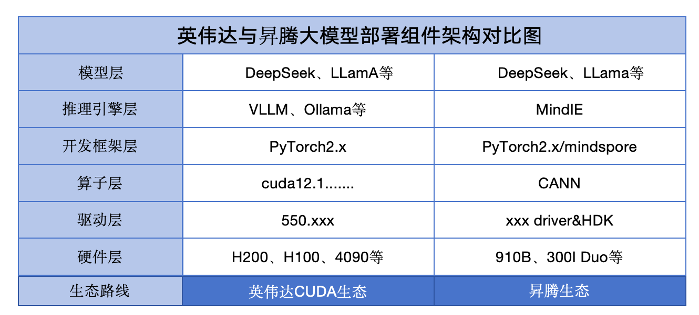

# Cuda&vLLM部署模型

## 一、整体架构



## 二、环境要求

- cuda12.1
- python3.12
- pytorch2.1+

## 三、模型部署

### 1、机器环境准备

- 驱动安装

```bash
# 查看操作系统情况
uname -a # 64/32位
cat /etc/os-release # 操作系统信息

# 查看 Nvidia GPU型号
lspci | grep -i nvidia

# 查看是否安装驱动
nvidia-smi # 通过GPU命令行工具判断
lsmod | grep nvidia # 查看加载到linux内核中的模块
sudo apt-get remove --purge nvidia* # 如原先安装过驱动，通过apt-get包管理彻底删除nvidia包与配置文件

# 查看开源驱动nouveau情况，如有请禁用
lsmod | grep nouveau # 没输出代表禁用生效

# 停止可视化界面，设置为命令行
sudo systemctl isolate multi-user.target

# 到nvidia官网下载相应型号的驱动：[https://www.nvidia.com/Download/index.aspx?lang=en-us](https://www.nvidia.com/Download/index.aspx?lang=en-us)
# 传输驱动文件至目标机器
scp /path/to/local/file user@remote_host:/path/to/remote/location

# 给驱动文件增加可执行权限
sudo chmod a+x 驱动文件

# 安装
sudo sh ./驱动文件 --no-opengl-files --no-x-check
# –no-opengl-files 只安装驱动文件，不安装OpenGL文件。
# –no-x-check 安装驱动时不检查X服务
# –no-nouveau-check 安装驱动时不检查nouveau
```

- cuda安装

```bash
# cuda-12.1
# 获取cuda runfile 文件
wget https://developer.download.nvidia.com/compute/cuda/12.1.1/local_installers/cuda_12.1.1_530.30.02_linux.run
sudo sh cuda_12.1.1_530.30.02_linux.run

# cuda runfile文件中包含了驱动、cuda toolkit、sample
# 按需求安装即可

# 配置环境变量
vim ~/.bashrc # 或者直接编辑系统配置文件/etc/bashrc
# 在配置文件末尾添加如下
export PATH="/usr/local/cuda-x.x/bin:$PATH"
export LD_LIBRARY_PATH="/usr/local/cuda-x.x/lib64:$LD_LIBRARY_PATH"
export CUDA_HOME="/usr/local/cuda"
# 刷新环境变量
source ~/.bashrc

# 验证安装
nvcc -V # 查看输出
```

- 环境管理miniconda

```bash
# 下载安装文件：[https://repo.anaconda.com/miniconda/](https://repo.anaconda.com/miniconda/)
wget https://repo.anaconda.com/miniconda/Miniconda3-py312_25.1.1-2-Linux-x86_64.sh

# 校验miniconda是否为官方文件【可选】
sha256sum filename

# 安装miniconda
chmod +x filename
bash filename

# 配置环境变量
vim ~/.bashrc
export PATH=$PATH:$HOME/miniconda3/bin
source ~/.bashrc
```

- 创建虚拟环境并安装pytorch

```bash
# 创建虚拟环境
conda create -n vllm-ds python==3.12 -y
conda activate vllm-ds
# 安装pytorch，注意cuda与pytorch版本
pip install torch==2.5.1 torchvision==0.20.1 torchaudio==2.5.1 --index-url https://download.pytorch.org/whl/cu121
```

- 安装vllm

```bash
# 安装vllm
pip install vllm
```

### 2、模型部署

- 模型下载

```bash
# 安装modelscope
pip install modelscope

# 下载权重
modelscope download --model deepseek-ai/DeepSeek-R1-Distill-Qwen-7B --local_dir ./ds-weight/
```

- 在线推理服务
    
    相关参数解释：[https://docs.vllm.ai/en/v0.4.1/serving/openai_compatible_server.html](https://docs.vllm.ai/en/v0.4.1/serving/openai_compatible_server.html)
    

```bash
# 部署openai api server
python3 -m vllm.entrypoints.openai.api_server 
--port 8000 
--model  /the_path_of_model_weight 
--served-model-name DeepSeek-R1-7B  
--tensor-parallel-size 4 
--quantization fp8 
--max-num-seqs 64 
--max_model_len=2048
--api-key=token-abc123

# 后台运行
nohup python3 -m vllm.entrypoints.openai.api_server --port 8000 --model  /home/ubuntu/ds-7b --served-model-name DeepSeek-R1-7B  --tensor-parallel-size 4 --quantization fp8 --max-num-seqs 64 --max_model_len=2048 --api-key=token-abc123 --gpu-memory-utilization=0.9 > ./ds_infer.log 2>&1 &

```

- 模型调用

```bash
# infer_test.py
from openai import OpenAI
client = OpenAI(
    base_url="http://localhost:8000/v1",
    api_key="token-abc123",
)

completion = client.chat.completions.create(
  model="DeepSeek-R1-7B",
  messages=[
    {"role": "user", "content": "Hello!"}
  ]
)

print(completion.choices[0].message)
```

### 3、部署OpenWebui及配置

```bash
略
```
