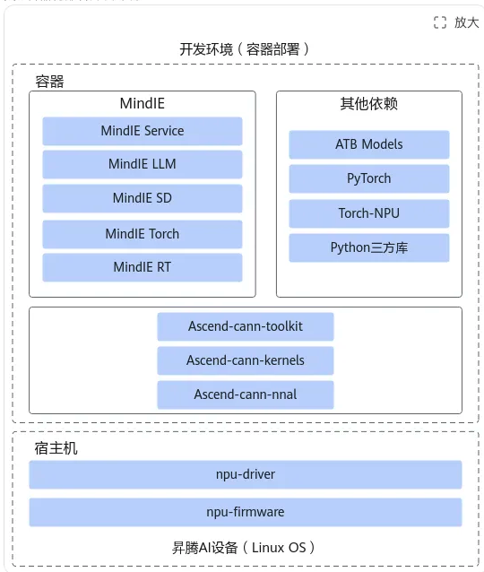
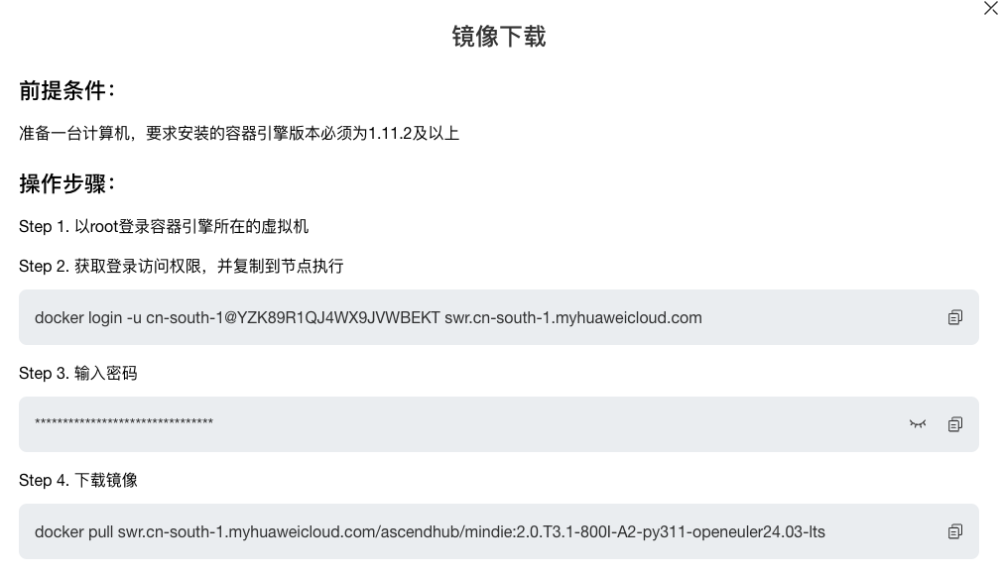
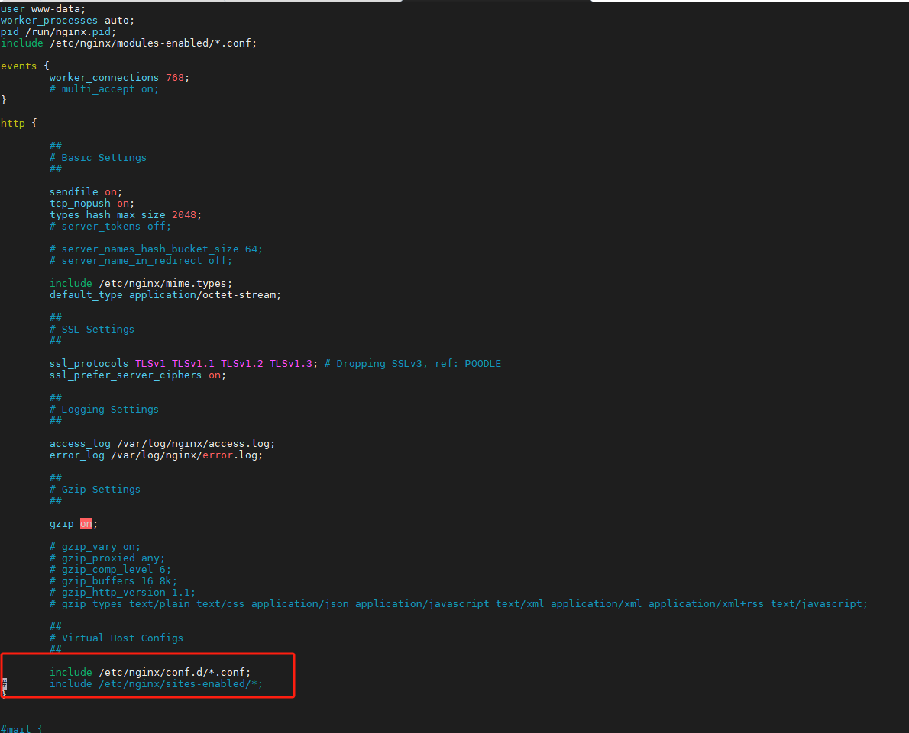

# DeepSeek部署

## 一、部署DS整体架构图

### 1、模型server部署过程：

- 昇腾从下往上：昇腾硬件设备 → 昇腾驱动与固件 → CANN → MindIE（华为推理引擎） → Server API
- 英伟达从下往上：Nvidia设备 → 驱动 →CUDA → VLLM（开源推理引擎） → Server API
    
    
    

## 二、DeepSeek模型部署

### 1、集群配置

- DeepSeek 671B@FP16： 4台910B物理机
- DeepSeek 671B@int8：2台910B物理机

### 2、机器整备

- 硬盘挂载确保权重空间充足

```bash
# 由于DS671B需要较大存储空间，查看存储情况，根据存储情况整理空间，确保存储空间够大
lsblk
df -h
## 1、扩容逻辑卷【按需操作】
sudo lvdisplay
sudo lvextend -L <增减逻辑卷容量> <逻辑卷路径>
	eg:sudo lvextend -L +350G /dev/system/lv_root
df -TH 查看文件系统类型
xfs: sudo xfs_growfs <逻辑挂载点>
ext4: sudo resize2fs <逻辑卷路径>
df -h

## 2、硬盘分区挂载[https://www.ctyun.cn/document/10027724/10249714]
disk大于2T：
parted /dev/nvme1n1
p
### if partition table unknown:mklabel gpt 
unit s 设置计量单位为磁柱
mkpart opt 2048s 100% 全量分区
p 查看分区
q 退出分区
lsblk
### 创建文件系统并挂载
mkfs -t ext4 /dev/nvme1n1p1
mkdir /root/ds-weight
mount /dev/nvme1n1p1 /root/ds-weight
df -TH
### 设置自动挂载
blkid /dev/nvme1n1p1
vi /tec/fstab
添加挂载点即可
```

### 2、模型权重下载

由于DeepSeek官方权重为FP8精度，昇腾910B暂不支持FP8精度，需要转换成FP16或量化INT8，建议直接通过华为obsutil下载量化后的INT8权重，加快部署

- 官方源下载方法：
    
    [模型权重官方仓库下载](DeepSeek部署手册/模型权重官方仓库下载.md)
    
- 华为obs权重下载

```bash
# 1、华为obsutil下载
mkdir obsutil && cd obsutil
wget https://obs-community-intl.obs.ap-southeast-1.myhuaweicloud.com/obsutil/current/obsutil_linux_arm64.tar.gz
tar -xzvf obsutil_linux_arm64.tar.gz
## 进入obsutil目录
chmod 755 obsutil
./obsutil version

# 2、下载模型权重
./obsutil share-cp [url] [local_dir] -ac=[access key] -f -r
url:源地址
local_dir: 本地路径
-ac=:提取码
-f:强制覆盖
-r:递归
--include:指定包含
--exclude:指定不包含

## 例子：
./obsutil share-cp https://e-share.obs-website.cn-north-1.myhuaweicloud.com?token=Mc5ctYe33RbxIwXZuyovVDBfEZ3fmYjNQriqEQ22huEhWyF9gWh8ox793kHEZnHV66r9jcGlbKF9+X/an5VO6hSPhH/TOiiJBrv5Kxn/pGK/WTkGaR86r503/PIue3tSVUc5/ohSxod5ErlyX32OT/Pt2EjOVBlpFjyPVpHjRgzZpUFMoZgeDhkYinyt135u6VArN0NgdOxo9mziDGmvxKEfGbPCLOSa4uDeCoyIdTYWXPHpLTBLF/mbIkjzmSvXO7Q9HbVAqmMdvzbqEZ9DNeSoM/lC2WmyARUFiTg1Lip9aTTM5yBmrwaap5gsnkx7R+M+WFW09x6mnn9JIuOkc+HczT/KDjNWxlHVH8NvtP4+ERLhZPAGZt+TPt7WrvRJJShdMYIWhqruG8ezJqXMd3KHWG4TzTBHF3VlEWPGMKtQ6N4R9pTAfD3+50QwIloRs+GthUV0bHiat0u6YQH5jZGXe0/VSRB0xNMhT3G3cOSczOS1WhZvcpu9fBq3U1q5Nll5lIlp3RXHdTDDFOui+NOEafiZpMdSMeVS6ZnXCiirY6M/mOYVtQkmnTL96R2cMN6RUScjzro/i1bc6LfA4EOPMGNCKJ98jKJ89WdhWRaAW5+pvYrSIWyRBXb3v+nflcYM9kEUb30bVnf8oMpcIiVeMGGchtYL8U2L+00KaOWkDbBM7XRQLLLaCCrbyaTn9JCJkGoP1QIjUMcOMDX0p212fXExf3A+E77q3qseotPl0PFYeJ064v7OfybmD38mND8G55lY7oLNMyqVuo3E0JNTJMwjh7GCjijhNfeGVLw= /data/DeepSeek-R1 -ac=Ascend -f -r
# 仅获取第78个safetensors
./obsutil share-cp [url] [local_dir] -ac=[access key] -include=*78*.safetensors -f -r

## 建议后台运行:
nohup *** > download.log 2>&1 &

## 权重地址
ds-r1-bf16:
https://e-share.obs-website.cn-north-1.myhuaweiclou.com?token=Mc5ctYe33RbxIwXZuyovVDBfEZ3fmYjNQriqEQ22huEhWyF9gWh8ox793kHEZnHV66r9jcGlbKF9+X/an5VO6hSPhH/TOiiJBrv5Kxn/pGK/WTkGaR86r503/PIue3tSVUc5/ohSxod5ErlyX32OT/Pt2EjOVBlpFjyPVpHjRgzZpUFMoZgeDhkYinyt135u6VArN0NgdOxo9mziDGmvxKEfGbPCLOSa4uDeCoyIdTYWXPHpLTBLF/mbIkjzmSvXO7Q9HbVAqmMdvzbqEZ9DNeSoM/lC2WmyARUFiTg1Lip9aTTM5yBmrwaap5gsnkx7R+M+WFW09x6mnn9JIuOkc+HczT/KDjNWxlHVH8NvtP4+ERLhZPAGZt+TPt7WrvRJJShdMYIWhqruG8ezJqXMd3KHWG4TzTBHF3VlEWPGMKtQ6N4R9pTAfD3+50QwIloRs+GthUV0bHiat0u6YQH5jZGXe0/VSRB0xNMhT3G3cOSczOS1WhZvcpu9fBq3U1q5Nll5lIlp3RXHdTDDFOui+NOEafiZpMdSMeVS6ZnXCiirY6M/mOYVtQkmnTL96R2cMN6RUScjzro/i1bc6LfA4EOPMGNCKJ98jKJ89WdhWRaAW5+pvYrSIWyRBXb3v+nflcYM9kEUb30bVnf8oMpcIiVeMGGchtYL8U2L+00KaOWkDbBM7XRQLLLaCCrbyaTn9JCJkGoP1QIjUMcOMDX0p212fXExf3A+E77q3qseotPl0PFYeJ064v7OfybmD38mND8G55lY7oLNMyqVuo3E0JNTJMwjh7GCjijhNfeGVLw=
ds-v3-bf16:
https://e-share.obs-website.cn-north-1.myhuaweicloud.com?token=Mc5ctYe33RbxIwXZuyovVDBfEZ3fmYjNQriqEQ22huEhWyF9gWh8ox793kHEZnHV66r9jcGlbKF9+X/an5VO6hSPhH/TOiiJBrv5Kxn/pGK/WTkGaR86r503/PIue3tSVUc5/ohSxod5ErlyX32OT/Pt2EjOVBlpFjyPVpHjRgzZpUFMoZgeDhkYinyt135u6VArN0NgdOxo9mziDGmvxKEfGbPCLOSa4uDeCoyIdTaKBYF2aLzNBTpWLc1Ef6H5cou56vX52FaAujg0n/cp+vemn+2OLEJr+hh+HPEGws4fx6QTo3auvMfVrMLlkr7pA5JmGamYE7vNKRa9g5XQcr5Zdl07+pGQbvY0K34sl9twqilzZHUrce6XUyqHeGrcO6cvkriXXUiiXdc2f2/e/wQ/mQxjx14+N5MZPsxkLiuTj6buVCGtCoBwLWt9wZdpTu/Jtyx/xX3G8flXQjrwBOEY5FULyHGnJrTWb1I8jb12zIjkIsXQfSFbSb7QrIFmRk4OXU287/gsQ7zmwxBgSGF73/dWLZZ+557BJ9rEJpawn8oc9p9iGkydC4+cmKtnnMLbNkEq+q+OF+MCrHa0D5bkFLp4CZEw+oe3wlleOBpmpiULrKNIdWCr6+cuhqiaWVLAlt8k0+zr8v5FGI4170wWvWoiOLFOdFJ5N2XUTx/GuVqxdzPzQb3ssqkXZmxSDVTNQ1CNbny3D9T6n8c5mSQqnbntfV7jsGYxE8tHmwmpXdrznCfDUSu6NADsKqKIGMtnw8qvCrGnfvnO5yvnSw==
ds-r1-w8a8:
https://e-share.obs-website.cn-north-1.myhuaweicloud.com?token=Mc5ctYe33RbxIwXZuyovVDBfEZ3fmYjNQriqEQ22huEhWyF9gWh8ox793kHEZnHV66r9jcGlbKF9+X/an5VO6hSPhH/TOiiJBrv5Kxn/pGK/WTkGaR86r503/PIue3tSVUc5/ohSxod5ErlyX32OT/Pt2EjOVBlpFjyPVpHjRgzZpUFMoZgeDhkYinyt135u6VArN0NgdOxo9mziDGmvxKEfGbPCLOSa4uDeCoyIdTYOpxnmPxt+5s19iYTBRHaHZN/v8eLHALNyzHmgIMmmMcSOHJ2AijG6igpSxw/nQ2/wbR/76AgocY4ooq9PwLQkybJMCqnSpfwoKg4ep35UHpSbI6osa7vZyQCJ8heQL+go6nk3D+VeLBMWBQDnvVskshGqb/j6jZAiQqj90v2CRZ2e3ducoEuxrb1V5JA6gPMmKCcjNil+TQ8Sf52NSLSOEcGJKaP1td07evb3UBOSi7vx/i3+lgFrAOyXjLzG8CVHPnG83DUxbaadj6gUZwSsdnF4TerRBRdtQoaoercWMlhl1Yi9ZYqgXotrjB8zVZZxN48C9RkpxzEmK2njegJXNyZdsjAtjhIG/N/Lnn+Vtl5FxyN5+SU5GnHVtV8bQaiuyIXjHzNXPgyZ71KJU2bog9VouPn/PZF2029wn4/4RN9gzVni+29ZiTUW6UiS0/AaA/6DVRX9OY/F2qnFtXv3t+Fmxk07hotAAiTJhv6C8v9J4mWzW+q1K5xYhXbdl91V5SOaajskrSPlxxxfJFMzHwrE55gzeY+hTmOL98ysg4otbsXKXiKrvb7sqTw6++ztgBwrDAjPvMfjUtIBf2aZpvEOrB7+tkkU+9bMwDLZOzrSCtGqIQWq3TZFrIK2SV4=
ds-v3-w8a8:
https://e-share.obs-website.cn-north-1.myhuaweicloud.com?token=Mc5ctYe33RbxIwXZuyovVDBfEZ3fmYjNQriqEQ22huEhWyF9gWh8ox793kHEZnHV66r9jcGlbKF9+X/an5VO6hSPhH/TOiiJBrv5Kxn/pGLrRSeSAZt6ZC8tlG1WccUeIy6/GHvqpG6tTY5tXBO1WXEFa3n/B16vpj0UDDAXvN7Ye/sTBrxxWP4HJaxF7PZCKucsNMN7yCjc9vxlwhZ/qiPe5/LI0SzHK7BtY9HSPGVaSWnp7yRRCLyFGSAti6u9eTZ6qKgJ7l+Ch0TlXNqSlZCsZd3f8G0NKMtILzgXUECgoggsWgP6ZZCbvpeSF0g9xIebIpGauCvcrFPp82ztPD5n/LQo5xXDlc4cZpcL8lHZ4tskq4K66uA0twX2xPBMUaJzNrPCWP88jKqg6l1pv3HkIfMNmJS+rvwfAXZGDH1m9iKiqO+UVDU0tmwXyKnXPKwog4u3+WDMZOGKoJMksClbKVMKXdIWFIYLbKEE3Qirq/9zzuvwJo02lonIzI+FoUXu8vCSoJE9wf/d+KKEaYeaSiHRvFiIc4nNcio0sT9vaUqXNXS0//lo1KZQZ5/dhE0rUWI6f/HXL/fTXQRuBNMYeiEHEU6wymRhc+qsogF2VbS6JD2SVhOyFpFY9BAmwkaLC0AXeaCWC6A4VKo88ypHlU2M64/xc/8Z8t2U3oLp+hdZjzSMnG5lh49IULxvjVxRyLrKTDtRAIvSPbEYuz2+S/HNLyqrmg/hmjtYvLOilX5UkGFzj1t1bq+J0DHumgYngnRkn/qRPCA1wmZtsw==
```

### 3、模型权重分发节点

- 将模型权重分发到所有节点的相同路径下
- 将权重路径设置组与权限

```bash
chown -R 1001:1001 /path-to-weights/DeepSeek-R1
chmod -R 750 /path-to-weights/DeepSeek-R1
```

### 4、拉取MindIe镜像

华为已在昇腾社区提供Docker镜像，部署过程中需申请下载权限，如审批过慢，可联系云省分使用省分账号拉取镜像

- 镜像地址[https://www.hiascend.com/developer/ascendhub/detail/af85b724a7e5469ebd7ea13c3439d48f](https://www.hiascend.com/developer/ascendhub/detail/af85b724a7e5469ebd7ea13c3439d48f)
- 拉取镜像



### 4、多机通信检查

- 健康状态检查

```bash
# 1、TLS检查
for i in {0..7}; do hccn_tool -i $i -tls -g ; done |grep switch
# TLS关闭
for i in {0..7}; do hccn_tool -i $i -tls -s enable 0 ; done

# 2、健康状态检查
## 检查物理链接
for i in {0..7}; do hccn_tool -i $i -lldp -g | grep Ifname; done
## 检查链接情况
for i in {0..7}; do hccn_tool -i $i -link -g ; done
## 检查网络健康情况
for i in {0..7}; do hccn_tool -i $i -net_health -g ; done
## 查看侦测ip配置情况
for i in {0..7}; do hccn_tool -i $i -netdetect -g ; done
## 查看网关是否配置正确
for i in {0..7}; do hccn_tool -i $i -gateway -g ; done
# 如果每台读取配置不输出，可以尝试重置NPU，-i 后面的编号0就是卡号，只需要复位一张卡，所有卡都会重置
npu-smi set -t reset -i 0 -c 0

```

### 5、启动容器

```bash
docker run -itd --privileged  --name=ds-v3-w8a8 --net=host \
   --shm-size 500g \
   --device=/dev/davinci0 \
   --device=/dev/davinci1 \
   --device=/dev/davinci2 \
   --device=/dev/davinci3 \
   --device=/dev/davinci4 \
   --device=/dev/davinci5 \
   --device=/dev/davinci6 \
   --device=/dev/davinci7 \
   --device=/dev/davinci_manager \
   --device=/dev/hisi_hdc \
   --device /dev/devmm_svm \
   -v /usr/local/Ascend/driver:/usr/local/Ascend/driver \
   -v /usr/local/Ascend/firmware:/usr/local/Ascend/firmware \
   -v /usr/local/sbin/npu-smi:/usr/local/sbin/npu-smi \
   -v /usr/local/sbin:/usr/local/sbin \
   -v /etc/hccn.conf:/etc/hccn.conf \
   -v /root/ds-v3/ds-v3-w8a8:/root/ds-v3/ds-v3-w8a8 \  ## 修改为权重路径
   swr.cn-south-1.myhuaweicloud.com/ascendhub/mindie:2.0.T3.1-800I-A2-py311-openeuler24.03-lts \ # 镜像名
   bash
   
   # 进入容器
   docker exec -it ds-v3-w8a8 bash
```

### 6、配置容器

```bash
# 1、修改权重目录下的config.json
model_type = 'deepseekv2'

# 2、配置rank_table_file.json
# 在宿主机执行如下命令，获取每张卡的id
for i in {0..7};do hccn_tool -i $i -ip -g; done
```

- 建议rank_table_file.json文件编写后，通过在线的json格式工具进行校验后复制

```bash
# rank_table_file.json
{
    "version": "1.0",
    "server_count": "2",
    "server_list": [
        {
            "server_id": "192.168.0.7",
            "container_ip": "192.168.0.7",
            "device": [
                { "device_id": "0", "device_ip": "100.97.1.209", "rank_id": "0" },
                { "device_id": "1", "device_ip": "100.97.1.210", "rank_id": "1" },
                { "device_id": "2", "device_ip": "100.97.1.211", "rank_id": "2" },
                { "device_id": "3", "device_ip": "100.97.1.212", "rank_id": "3" },
                { "device_id": "4", "device_ip": "100.97.1.213", "rank_id": "4" },
                { "device_id": "5", "device_ip": "100.97.1.214", "rank_id": "5" },
                { "device_id": "6", "device_ip": "100.97.1.215", "rank_id": "6" },
                { "device_id": "7", "device_ip": "100.97.1.216", "rank_id": "7" }]},
        {
            "server_id": "192.168.0.6",
            "container_ip": "192.168.0.6",
            "device": [
                { "device_id": "0", "device_ip": "100.97.1.193", "rank_id": "8" },
                { "device_id": "1", "device_ip": "100.97.1.194", "rank_id": "9" },
                { "device_id": "2", "device_ip": "100.97.1.195", "rank_id": "10" },
                { "device_id": "3", "device_ip": "100.97.1.196", "rank_id": "11" },
                { "device_id": "4", "device_ip": "100.97.1.197", "rank_id": "12" },
                { "device_id": "5", "device_ip": "100.97.1.198", "rank_id": "13" },
                { "device_id": "6", "device_ip": "100.97.1.199", "rank_id": "14" },
                { "device_id": "7", "device_ip": "100.97.1.200", "rank_id": "15" }]}],
    "status": "completed"}
# 赋予文件权限
sudo chmod 640 /path of rank_table_file.json
```

### 7、模型服务部署

- 集群内所有机器皆需要执行下面操作
    
    ```bash
    # 配置环境变量
    export ATB_LLM_HCCL_ENABLE=1
    export ATB_LLM_COMM_BACKEND="hccl"
    export HCCL_CONNECT_TIMEOUT=7200
    export WORLD_SIZE=32
    export HCCL_EXEC_TIMEOUT=0
    
    export OMP_NUM_THREADS=1
    export PYTORCH_NPU_ALLOC_CONF=expandable_segments:True
    export MIES_CONTAINER_IP=192.168.0.6 # 本机ip
    export RANKTABLEFILE=/root/rank_table_file.json # 本机json
    export HCCL_DETERMINISTIC=true
    export NPU_MEMORY_FRACTION=0.96
    
    # 其次修改服务化参数：
    cd /usr/local/Ascend/mindie/latest/mindie-service/
    vim conf/config.json
    
    # 修改如下参数
    "httpsEnabled" : false,
    ...
    "multiNodesInferEnabled" : true, # true为开启多机推理
    ...
    # 若不需要安全认证，则将以下两个参数设为false
    "interCommTLSEnabled" : false,
    "interNodeTLSEnabled" : false,
    ...
    "modelName" : "DeepSeek-R1" # 不影响服务化拉起
    "modelWeightPath" : "权重路径",
    
    # 起服务
    cd /usr/local/Ascend/mindie/latest/mindie-service/
    ./bin/mindieservice_daemon
    # 注意报错日志输出，daemon successed 表示服务拉起成功
    # 常见报错处理方式：
    # config.json 权限报错
    chown root:root config.json
    chmod 650 config.json
    
    # 后台方式拉起服务
    nohup ./bin/mindieservice_daemon > /var/log/mindieservice.log 2>&1 &
    通过tail -f /var/log/mindieservice.log 查看输出
    
    ```
    
- 测试服务
    
    ```bash
    # 提问
    curl -H "Accept: application/json" -H "Content-type: application/json"  -X POST -d '{
     "inputs": "介绍一下苏州特色",
     "stream": false,
     "parameters": {
      "temperature": 0.5,
      "top_k": 10,
      "top_p": 0.95,
      "max_new_tokens": 2048,
      "do_sample": true,
      "seed": null,
      "repetition_penalty": 1.03,
      "details": true,
      "typical_p": 0.5,
      "watermark": false
     }
    }' http://121.229.206.63:1025/infer # 地址修改为master ip
    ```
    

## 三、Open-Webui配置

```bash
# 安装C编译器
sudo yum groupinstall -y "Development Tools"
sudo yum install -y openssl-devel bzip2-devel libffi-devel zlib-devel
wget ``https://www.python.org/ftp/python/3.11.0/Python-3.11.0.tgz``（拉取较慢，可直接本地下载后上传）
tar -xvzf Python-3.11.0.tgz
cd Python-3.11.0
./configure --enable-optimizations
make -j$(nproc)
sudo make altinstall
python3.11 --version
python3.11 -m venv /opt/webui-env

# 激活环境
source /opt/webui-env/bin/activate
pip install open-webui -i [https://pypi.tuna.tsinghua.edu.cn/simple](https://pypi.tuna.tsinghua.edu.cn/simple) 

# 启动服务
nohup open-webui serve > /var/log/open-webui.log 2>&1 &
# 查看日志
tail -f /var/log/open-webui.log
```

### Nginx代理

配置Nginx反向代理端口

```bash
# nginx
yum install -y nginx

```

```bash

# 在/etc/nginx/conf.d/目录下创建文件openwebui.conf，在文件openwebui.conf中添加以下内容：
# HTTPS server for 你的域名   #填入你的域名
server {
    listen 8081;
    #server_name 你的域名;#填入你的域名

    # SSL 配置
    #ssl_certificate /etc/nginx/certs/cert.pem;    #证书
    #ssl_certificate_key /etc/nginx/certs/key.pem; #证书密钥

    # WebSocket support
    location /ws/ {
        proxy_pass http://127.0.0.1:8080/ws/;  # 根据实际 WebSocket 服务路径调整
        proxy_http_version 1.1;
        proxy_set_header Upgrade $http_upgrade;
        proxy_set_header Connection "Upgrade";
        proxy_set_header Host $host;
        proxy_set_header X-Real-IP $remote_addr;
        proxy_set_header X-Forwarded-For $proxy_add_x_forwarded_for;
        proxy_set_header X-Forwarded-Proto $scheme;
    }

    # 其他 SSL 配置（例如 TLS 强化配置）
    #ssl_protocols TLSv1.2 TLSv1.3;
    #ssl_ciphers 'ECDHE-ECDSA-AES128-GCM-SHA256:ECDHE-RSA-AES128-GCM-SHA256';

    # 默认 location 配置
    location / {
        proxy_pass http://127.0.0.1:8080; #填入你的openwebui的容器名+端口号
        proxy_set_header Host $host;
        proxy_set_header X-Real-IP $remote_addr;
        proxy_set_header X-Forwarded-For $proxy_add_x_forwarded_for;
        proxy_set_header X-Forwarded-Proto $scheme;
    }
}

```

- Nginx启动会默认使用80端口，可将/etc/nginx/nginx.conf文件里的include /etc/nginx/sites-enabled/*注释掉：



### 修改容器配置

```bash
# 修改service json
vim /usr/local/Ascend/mindie/latest/mindie-service/conf/config.json
```


